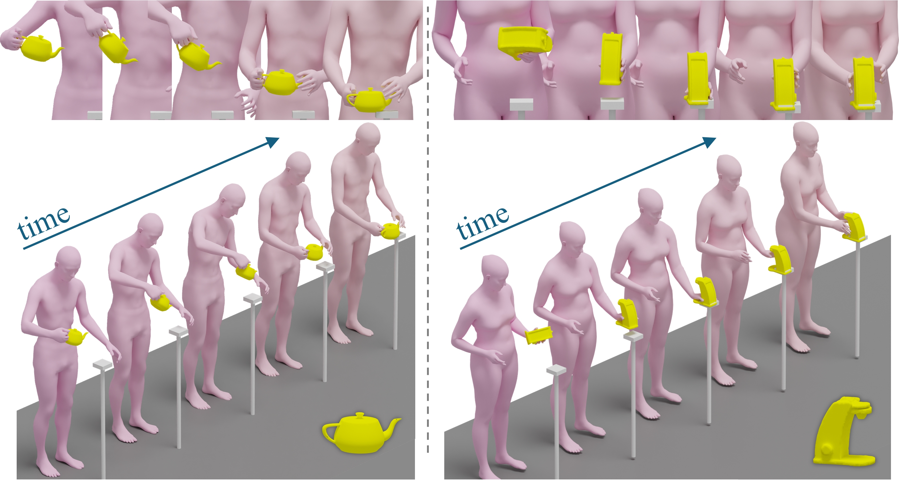

# DiffGrasp: Whole-Body Grasping Synthesis Guided by Object Motion Using a Diffusion Model
## Official PyTorch implementation of the AAAI 2025 paper ##

[Project page](https://iscas3dv.github.io/DiffGrasp/) | [Paper](https://arxiv.org/abs/2412.20657) | [Bilibili](https://www.bilibili.com/video/BV1Yn6uYQENd/)


## About
<div style="text-align: center;">
    
</div>
Generating high-quality whole-body human object interaction motion sequences is becoming increasingly important in various fields such as animation, VR/AR, and robotics. The main challenge of this task lies in determining the level of involvement of each hand given the complex shapes of objects in different sizes and their different motion trajectories, while ensuring strong grasping realism and guaranteeing the coordination of movement in all body parts. Contrasting with existing work, which either generates human interaction motion sequences without detailed hand grasping poses or only models a static grasping pose, we propose a simple yet effective framework that jointly models the relationship between the body, hands, and the given object motion sequences within a single diffusion model. To guide our network in perceiving the object's spatial position and learning more natural grasping poses, we introduce novel contact-aware losses and incorporate a data-driven, carefully designed guidance. Experimental results demonstrate that our approach outperforms the state-of-the-art method and generates plausible whole-body motion sequences.
</br>


## Requirements
This package has the following requirements:

- Python >=3.8.0
- [Pytorch](https://pytorch.org/get-started/locally/)>=1.13.0 (cuda version==11.6)
- [pytroch3d](https://pytorch3d.org/) >=0.7.5
- [Kaolin](https://kaolin.readthedocs.io/en/latest/index.html)==0.15.0
- [SMPLX](https://github.com/vchoutas/smplx)
- [bps_torch](https://github.com/otaheri/bps_torch)
- [aitviewer](https://eth-ait.github.io/aitviewer/)

## Installation
To install the dependencies please follow the next steps:

- Clone this repository
- Install the dependencies:
    ```
    pip install -r requirements.txt
    ```
- [Download](https://smpl-x.is.tue.mpg.de/) SMPL-X model, and place it to `./para_models/smplx`.
## Data Preparation
### GRAB Dataset
- Download the GRAB dataset from the [GRAB website](https://grab.is.tue.mpg.de/), and follow the instructions there to extract the files. Save the raw data in `../DATASETS/GRAB`.

- Sample 4000 points for each object in the GRAB dataset:

    ```
    python data/preprocess_GRAB_objects.py
    ```

- To pre-process the GRAB dataset for our setting, run:

    ```
    python data/process_GRAB.py
    ```

## Pre-trained Model

Please download the GRAB dataset [checkpoint](https://drive.google.com/file/d/1VGT4t-FPQT6bddhYp-Ujq8bkRf9WK8Bs/view?usp=sharing) and put them in the folders as below.

```
   DiffGrasp
    ├── work_dir
    │   ├── DiffGrasp
    │   │   ├── snapshots
    │   │   │   ├──E300_model.pt
    │   │   │   │
    │   │   │   │
    .
    .
    .
```

## Training

```
python train_DiffGrasp.py --mode=training
```

## Evaluation
If you have downloaded checkpoint, you can inference directly; otherwise, please train DiffGrasp first.

```
python train_DiffGrasp.py --mode=inference
```

## Visualization
We use [aitviewer](https://eth-ait.github.io/aitviewer/) to visualize the results.
Please run on the server side:
```
python ait_vis.py
```
Launch an empty viewer with the command:
```
python -m aitviewer.server
```


## Citation
```
@article{Zhang2025DiffGrasp, 
    title={DiffGrasp: Whole-Body Grasping Synthesis Guided by Object Motion Using a Diffusion Model}, 
    author={Zhang, Yonghao and He, Qiang and Wan, Yanguang and Zhang, Yinda and Deng, Xiaoming and Ma, Cuixia and Wang, Hongan}, 
    url={https://ojs.aaai.org/index.php/AAAI/article/view/33120}, 
    journal={Proceedings of the AAAI Conference on Artificial Intelligence}, 
    year={2025}
}
```